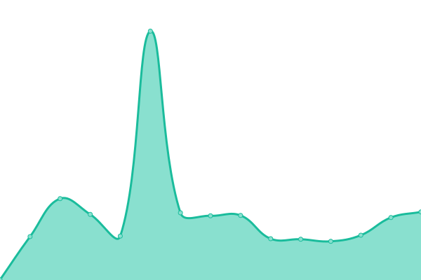

# [📈 Live Status](https://status.theravenhub.com): <!--live status--> **🟧 Partial outage**

This repository contains the open-source uptime monitor and status page for [rabenherz112](https://status.theravenhub.com), powered by [Upptime](https://github.com/upptime/upptime).

With [Upptime](https://upptime.js.org), you can get your own unlimited and free uptime monitor and status page, powered entirely by a GitHub repository. We use [Issues](https://github.com/rabenherz112/uptime-monitor/issues) as incident reports, [Actions](https://github.com/rabenherz112/uptime-monitor/actions) as uptime monitors, and [Pages](https://status.theravenhub.com) for the status page.

<!--start: status pages-->
<!-- This summary is generated by Upptime (https://github.com/upptime/upptime) -->
<!-- Do not edit this manually, your changes will be overwritten -->
<!-- prettier-ignore -->
| URL | Status | History | Response Time | Uptime |
| --- | ------ | ------- | ------------- | ------ |
|  Ravenhub (Main Page) | 🟩 Up | [ravenhub-main-page.yml](https://github.com/Rabenherz112/uptime-monitor/commits/HEAD/history/ravenhub-main-page.yml) | 

 943ms
     
 | 

<a href="https://status.theravenhub.com/history/ravenhub-main-page">100.00%</a>
    

|  Ravenhub URL Shortner (Frontend) | 🟩 Up | [ravenhub-url-shortner-frontend.yml](https://github.com/Rabenherz112/uptime-monitor/commits/HEAD/history/ravenhub-url-shortner-frontend.yml) | 

 397ms
     
 | 

<a href="https://status.theravenhub.com/history/ravenhub-url-shortner-frontend">51.30%</a>
    

|  Ravenhub URL Shortner (Backend) | 🟩 Up | [ravenhub-url-shortner-backend.yml](https://github.com/Rabenherz112/uptime-monitor/commits/HEAD/history/ravenhub-url-shortner-backend.yml) | 

 216ms
     
 | 

<a href="https://status.theravenhub.com/history/ravenhub-url-shortner-backend">100.00%</a>
    

|  Ravenhub Builderman (Website) | 🟩 Up | [ravenhub-builderman-website.yml](https://github.com/Rabenherz112/uptime-monitor/commits/HEAD/history/ravenhub-builderman-website.yml) | 

 1282ms
     
 | 

<a href="https://status.theravenhub.com/history/ravenhub-builderman-website">100.00%</a>
    

|  Ravenhub Dropbox | 🟩 Up | [ravenhub-dropbox.yml](https://github.com/Rabenherz112/uptime-monitor/commits/HEAD/history/ravenhub-dropbox.yml) | 

 141ms
     
 | 

<a href="https://status.theravenhub.com/history/ravenhub-dropbox">46.32%</a>
    

|  Ravenhub ShareX | 🟩 Up | [ravenhub-share-x.yml](https://github.com/Rabenherz112/uptime-monitor/commits/HEAD/history/ravenhub-share-x.yml) | 

 270ms
     
 | 

<a href="https://status.theravenhub.com/history/ravenhub-share-x">19.39%</a>
    

|  VS-NETCUP-01 (Server) | 🟥 Down | [vs-netcup-01-server.yml](https://github.com/Rabenherz112/uptime-monitor/commits/HEAD/history/vs-netcup-01-server.yml) | 

 0ms
     
 | 

<a href="https://status.theravenhub.com/history/vs-netcup-01-server">1.97%</a>
    

|  VS-STRATO-01 (Server) | 🟥 Down | [vs-strato-01-server.yml](https://github.com/Rabenherz112/uptime-monitor/commits/HEAD/history/vs-strato-01-server.yml) | 

 0ms
     
 | 

<a href="https://status.theravenhub.com/history/vs-strato-01-server">0.04%</a>
    

|  VS-LIS-HETZNER01 (Server) | 🟥 Down | [vs-lis-hetzner-01-server.yml](https://github.com/Rabenherz112/uptime-monitor/commits/HEAD/history/vs-lis-hetzner-01-server.yml) | 

 0ms
     
 | 

<a href="https://status.theravenhub.com/history/vs-lis-hetzner-01-server">1.99%</a>
    

<!--end: status pages-->

[**Visit our status website →**](https://status.theravenhub.com)

## 📄 License

- Powered by: [Upptime](https://github.com/upptime/upptime)
- Code: [MIT](./LICENSE) © [rabenherz112](https://status.theravenhub.com)
- Data in the `./history` directory: [Open Database License](https://opendatacommons.org/licenses/odbl/1-0/)
